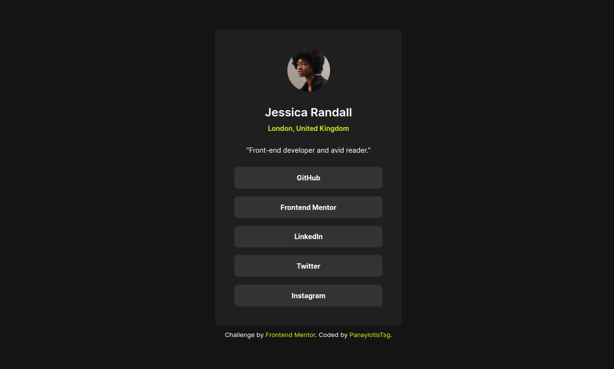

<h1 align='center'>Social Links Profile</h1>

<h3 align='center'>
    <a href=''>Solution</a>
    |
    <a href='https://panayiotistsg.github.io/social-links-profile/'>Live</a>
    |
    <a href='https://www.frontendmentor.io/challenges/social-links-profile-UG32l9m6dQ'>Challenge</a>
</h3>

## About

This is a solution to the [Social Links Profile challenge on Frontend Mentor](https://www.frontendmentor.io/challenges/social-links-profile-UG32l9m6dQ). Frontend Mentor challenges help you improve your coding skills by building realistic projects. 

## Built with

- HTML5
- CSS
- Flexbox